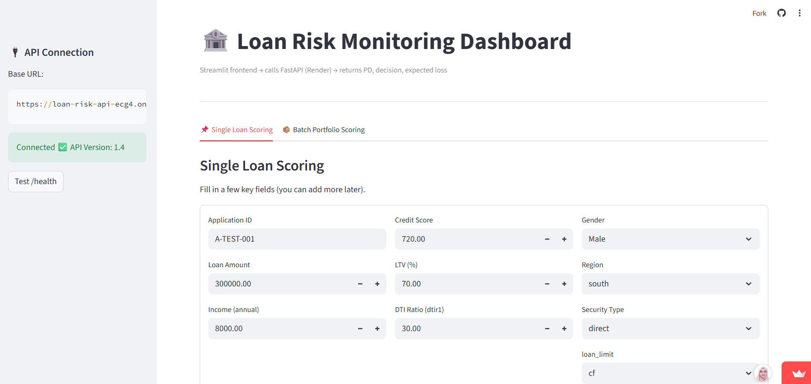

# Loan Risk Monitoring System

Production-ready Credit Risk Scoring API built using FastAPI and Logistic Regression.

This project simulates how financial institutions operationalize Probability of Default (PD) models into automated lending decision systems. The architecture reflects real-world enterprise delivery used in banks and fintech environments. The system includes:

- Probability of Default (PD) modeling
- Risk-based approval policy (Approve / Manual Review / Reject)
- Expected Loss estimation
- Portfolio-level monitoring dashboard
- Cloud deployment and API-based model serving

---

## 🌐 Live Demo

**🔗 Live Risk Scoring API (FastAPI - Render)**  
https://loan-risk-api-ecg4.onrender.com/docs  

**📊 Live Risk Monitoring Dashboard (Streamlit)**  
https://loan-risk-monitoring-system.streamlit.app

> The dashboard calls the production API in real time and returns PD, decision outcomes and expected loss calculations.

---

## 📌 Problem

Banks must balance:

- Credit risk mitigation
- Operational efficiency
- Fairness & governance
- Capital protection

This system demonstrates how a PD model transitions from experimentation to production deployment with business rules and risk policy.

---

## 🧠 Business Logic

Model: Logistic Regression  
Metric: ROC-AUC = 0.8675  

Decision threshold policy:

- PD < 0.30 → APPROVE  
- 0.30 ≤ PD < 0.60 → MANUAL_REVIEW  
- PD ≥ 0.60 → REJECT  

Expected Loss:

Expected Loss = PD × Loan Amount × LGD

Where:
- PD = Probability of Default
- LGD = Loss Given Default (assumed 60%)

---

## 📦 API Endpoints

| Method | Endpoint | Description |
|--------|----------|-------------|
| GET | /health | Service health check |
| POST | /predict | Single loan scoring |
| POST | /batch_predict | Portfolio scoring |

---

## 🏗 Architecture

User (Browser)
    ↓
Streamlit Dashboard (Cloud)
    ↓
FastAPI Risk API (Render Cloud)
    ↓
Scikit-learn Model Pipeline
    ↓
Business Policy Engine (Threshold Logic)
    ↓
JSON Response

---

## ⚖ Governance Considerations

- Threshold tuning based on risk appetite
- Fairness diagnostics across demographic groups
- Dependency freezing for reproducibility
- Health endpoint for monitoring

---

## 📸 Dashboard Preview

